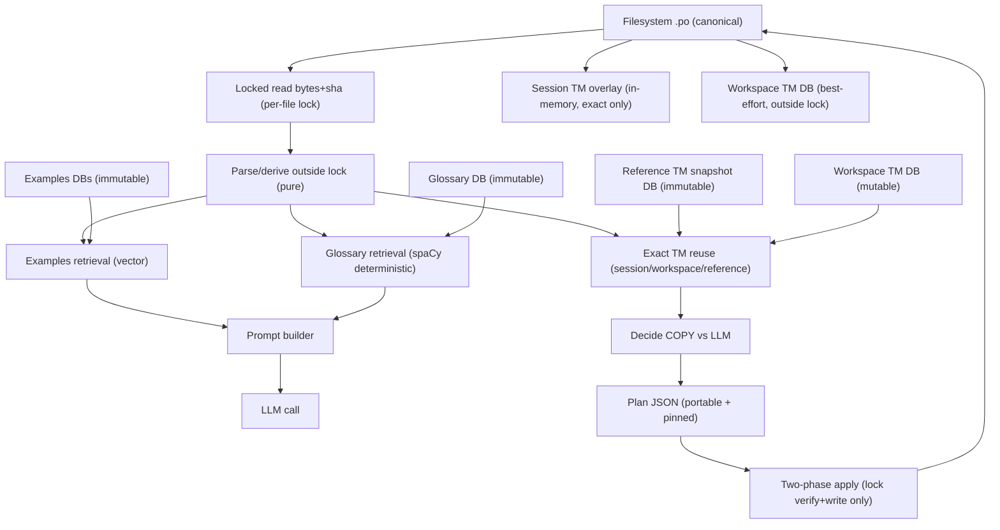

# Engineering Specification: KDEAI Translation System

**Version:** 1.0  
**Status:** Implementation Ready  
**Runtime:** Python 3.12+  
**Storage:** SQLite  
**Key libraries:** `polib`, `portalocker`, `spaCy`, `sqlite-vector`

---

## 1. Goals and Non-Goals

### 1.1 Goals
- Safely translate `.po` files with **snapshot-pinned correctness** and **verified writes**.
- Provide **exact-match Translation Memory (TM) reuse** that is **eligible for writing**.
- Provide **few-shot examples** and a **glossary** that are **prompt-only** and never directly written.
- Remain correct and usable if caches are missing/corrupt/stale/locked.
- Be deterministic: same inputs + same config ⇒ same plan + same apply result.

### 1.2 Non-Goals
- Multi-process KDEAI concurrency within a project. KDEAI is **single-process per project** by design.
- Automatic background indexing or daemon operation.
- FTS-based similarity retrieval (not required; not used by default).

---

## 2. Core Principles

### 2.1 Canonical artifacts
- **`.po` files on disk are canonical** (the committed/shipped truth).
- Everything under `.kdeai/cache/` is **advisory and disposable**.

### 2.2 Single-process rule (project-wide)
- All commands must acquire an **exclusive global run lock** for the project at startup and release on exit.
- This prevents concurrent KDEAI processes from operating on the same project simultaneously.

### 2.3 Snapshot-pinned correctness for writes
Any command that writes `.po` files must:
- read file bytes under a **per-file lock**,
- compute `base_sha256 = sha256(bytes)`,
- generate plan/apply decisions from those pinned bytes,
- verify on apply by re-reading under lock and refusing unsafe writes.

### 2.4 Lock discipline (critical)
While holding a `.po` per-file lock, KDEAI must **not** perform:
- any SQLite read/write,
- any filesystem walk (directory enumeration),
- any embedding computation,
- any LLM/network call,
- any long-running operation.

Per-file locks are reserved for **fast read/hash/stat** and **fast verify + atomic write** only.

### 2.5 Cache disposability
If any cache DB/pointer is missing, stale, locked, corrupt, or mismatched:
- retrieval quality may degrade (e.g., zero examples),
- apply safety must not degrade.

Only explicit maintenance commands may fail due to cache/index problems:
- `index`
- `reference build`
- `examples build`
- `glossary build`
- `gc`
- `doctor --repair-cache`

### 2.6 Separation of retrieval products (mandatory)
KDEAI produces three strictly separated products:

1) **TM reuse (write-eligible)**
- `--cache=off`:
  - no SQLite DB opens
  - TM reuse is available **only** from the **session TM overlay** (in-memory exact matches)
  - examples/glossary retrieval returns empty
  - KDEAI must not perform any project-wide on-disk TM scan as a substitute for SQLite caches when `--cache=off`.
- Eligibility:
  - **exact match on `(source_key, lang)`**, and
  - candidate translation is **non-empty** (see §17.1 “Non-empty eligibility”).
- Output: translation candidate eligible to be written (subject to overwrite policy and apply validators).

2) **Few-shot examples (prompt-only)**
- Eligibility: similarity retrieval via **vector embeddings + sqlite-vector**
- Output: example pairs used only to construct prompts
- **Hard rule:** examples are never directly copied into `.po` entries

3) **Glossary terms (prompt-only)**
- Eligibility: deterministic token/lemma matching using spaCy normalization
- Output: term recommendations used only for prompts
- **Hard rule:** glossary terms are never directly written into `.po` entries

This separation must be enforced in code structure, API boundaries, and ranking logic.

### 2.7 No DB-local identifiers in `.po` or plans
The tool must never write into `.po` files or Plan JSON:
- SQLite row ids, DB filenames, snapshot IDs, internal scan IDs, vector index ids.

Allowed portable markers in `.po`:
- flags: `fuzzy`, and the configured AI flag (default `kdeai-ai`)
- tool-owned translator comments (prefixes configured; defaults shown in §9)
- optional portable trace marker (off by default), also must be free of DB-local IDs.

---

## 3. High-Level Architecture



---

## 4. Project State Layout

All state lives under `.kdeai/`:

```
.kdeai/
  project.json
  config.json
  run.lock
  locks/
    <lock_id>.lock

  cache/
    workspace.tm.sqlite

    reference/
      reference.<snapshot_id>.sqlite
      reference.current.json

    examples/
      workspace/
        examples.workspace.<lang>.<ex_id>.sqlite
        examples.workspace.<lang>.current.json
      reference/
        examples.reference.<lang>.<snapshot_id>.<ex_id>.sqlite
        examples.reference.<lang>.current.json

    glossary/
      glossary.<snapshot_id>.sqlite
      glossary.current.json

  plans/        (optional)
  logs/         (optional)
```

Single-process means no separate pointer lock is required; the run lock serializes pointer swaps.

---

## 5. Configuration

### 5.1 Config file
- Path: `.kdeai/config.json`
- Must be human-editable.
- Must not contain secrets.

### 5.2 Canonical JSON and `config_hash`
`config_hash = sha256(canonical_json(config))`, where:
- keys sorted
- compact separators: `(",", ":")`
- UTF-8 encoding

This single hash pins all semantics that affect planning/applying and cache compatibility.

### 5.3 `embed_policy_hash` (required)
Computed from canonical JSON containing at minimum:

- `model_id` (string)
- `dim` (int)
- `distance` (enum supported by sqlite-vector; canonical lower-case string, e.g. `"cosine"`)
- `encoding` (must be `"float32_le"`)
- `input_canonicalization` (must reference §8.3 exactly; required value `"source_text_v1"`)
- `normalization` (e.g. `"none"` or `"l2_normalize"`)
- `require_finite` (bool; default `true`)

Any change to these fields makes existing examples DBs **incompatible** and therefore unusable.

### 5.4 Required config fields

```json
{
  "format": 2,

  "languages": {
    "source": "en",
    "targets": ["de", "fr"]
  },

  "markers": {
    "ai_flag": "kdeai-ai",
    "comment_prefixes": {
      "tool": "KDEAI:",
      "ai": "KDEAI-AI:",
      "tm": "KDEAI-TM:",
      "review": "KDEAI-REVIEW:"
    }
  },

  "tm": {
    "lookup_scopes": ["session", "workspace", "reference"],
    "selection": {
      "review_status_order": ["reviewed", "draft", "needs_review", "unreviewed"],
      "prefer_human": true
    }
  },

  "prompt": {
    "examples": {
      "mode_default": "auto",
      "lookup_scopes": ["workspace", "reference"],
      "top_n": 6,
      "embedding_policy": {
        "model_id": "provider/model@version",
        "dim": 384,
        "distance": "cosine",
        "encoding": "float32_le",
        "normalization": "none",
        "input_canonicalization": "source_text_v1",
        "require_finite": true
      },
      "eligibility": {
        "min_review_status": "reviewed",
        "allow_ai_generated": false
      }
    },

    "glossary": {
      "mode_default": "auto",
      "lookup_scopes": ["reference"],
      "spacy_model": "en_core_web_sm",
      "normalization_id": "kdeai_glossary_norm_v1",
      "max_terms": 10
    }
  },

  "apply": {
    "mode_default": "strict",
    "overwrite_default": "conservative",
    "tagging": {
      "tm_copy": { "add_flags": ["fuzzy"], "add_ai_flag": false, "comment_prefix_key": "tm" },
      "llm":     { "add_flags": ["fuzzy"], "add_ai_flag": true,  "comment_prefix_key": "ai" }
    }
  },

  "sqlite": {
    "workspace_tm": {
      "synchronous": "normal",
      "busy_timeout_ms": { "read": 5000, "write": 50 }
    }
  }
}
```

### 5.5 Overwrite policy enum
`apply.overwrite_default` and CLI `--overwrite` use:

- `conservative`:
  - do not overwrite non-empty translations
  - do not overwrite `reviewed` entries
- `allow-nonempty`:
  - may overwrite non-empty when entry is not `reviewed` (subject to verification)
- `allow-reviewed`:
  - may overwrite `reviewed` entries when translation is empty (rare; primarily for header/edge cases; still validator-gated)
- `all`:
  - may overwrite non-empty and reviewed entries (still subject to verification rules; never bypasses pinned safety)

(Exact per-entry checks are specified in §20 and must remain deterministic.)

---

## 6. Identity, Paths, and Locking

### 6.1 Project identity
`.kdeai/project.json` is created on first run and reused:

```json
{
  "format": 1,
  "project_id": "hex...",
  "created_at": "ISO-8601",
  "path_casefold": true,
  "method": "posix_dev_ino | win_file_id | realpath_fallback"
}
```

`project_id` generation:
- POSIX preferred: hash of `(st_dev, st_ino)` for `.kdeai/`
- Windows preferred: hash of directory file id
- fallback: hash of resolved absolute real path of `.kdeai/` (logged)

### 6.2 Normalized paths
All internal references to `.po` files use normalized project-root-relative paths:
- POSIX separators `/`
- no `.` or `..`
- no duplicate slashes

`relpath_key`:
- if `path_casefold=true`: `normalized_relpath.casefold()`
- else: `normalized_relpath`

### 6.3 Global run lock (single-process rule)
- Lock file: `.kdeai/run.lock`
- All commands must acquire exclusive lock at start; fail fast if unavailable.

### 6.4 Per-file lock (universal namespace)
Lock id and path:
- `lock_id = sha256(project_id + "\n" + relpath_key)`
- `.kdeai/locks/<lock_id>.lock`

Any operation that:
- reads bytes for planning/verification, or
- verifies/writes `.po`
must use this lock.

Implementation: `portalocker` exclusive lock.

---

## 7. Snapshot Primitive

### 7.1 `LockedRead`
Fields:
- `file_path` (normalized relpath)
- `bytes` (exact bytes read)
- `sha256` (sha256 of bytes)
- `mtime_ns`, `size` (captured while locked; diagnostic/advisory)

### 7.2 `locked_read_file(file_path) -> LockedRead`
Algorithm:
1. acquire per-file lock
2. read all bytes
3. compute sha256(bytes)
4. `stat()` file (mtime_ns, size)
5. release per-file lock
6. return `LockedRead`

---

## 8. PO Parsing and Canonical Text

### 8.1 PO model rules
Using `polib`:
- header entry (`msgid == ""`) excluded from translation units
- obsolete entries excluded
- identity fields: `(msgctxt, msgid, msgid_plural)`

Serialization:
- semantic content preserved; formatting may change
- unknown flags and non-tool comments preserved unless explicitly patched

### 8.2 `source_key`
```
source_key = sha256(msgctxt + "\u0004" + msgid + "\u0000" + msgid_plural)
```

### 8.3 Canonical source text (`source_text_v1`)
Used for prompts and embeddings:

```
source_text_v1 =
  "ctx:" + msgctxt + "\n" +
  "id:" + msgid + "\n" +
  "pl:" + msgid_plural
```

### 8.4 Canonical plural JSON
- keys are strings `"0"`, `"1"`, …
- keys sorted
- compact separators

`json.dumps(obj, sort_keys=True, separators=(",", ":"))`

---

## 9. Markers, Review Status, AI-Generated

### 9.1 Tool-owned namespaces
Tool-owned translator comment prefixes are configured in:
`markers.comment_prefixes` (defaults: `KDEAI:`, `KDEAI-AI:`, `KDEAI-TM:`, `KDEAI-REVIEW:`)

KDEAI may only remove/replace comment lines within those prefixes.

### 9.2 Default tagging policy
Policy is controlled by `apply.tagging.*`:

- TM copy:
  - add flags listed in `apply.tagging.tm_copy.add_flags` (default includes `fuzzy`)
  - do not add AI flag when `add_ai_flag=false`
  - ensure one tool comment line under the configured TM prefix, e.g. `KDEAI-TM: copied_from=<session|workspace|reference>`
- LLM output:
  - add flags listed in `apply.tagging.llm.add_flags` (default includes `fuzzy`)
  - add AI flag when `add_ai_flag=true`
  - ensure `KDEAI-AI: model=<model_id>`

### 9.3 Derived status
- `review_status`:
  1. untranslated → `unreviewed`
  2. else if `fuzzy` → `needs_review`
  3. else if reviewed marker present → `reviewed`
  4. else → `draft`

Default reviewed marker written by KDEAI:
- `KDEAI-REVIEW: reviewed_by=<name> date=<YYYY-MM-DD>`

- `is_ai_generated = 1` if:
  - the configured AI flag is present, or
  - any tool comment line exists under the configured AI prefix.

---

## 10. Hashes for Safety and Determinism

### 10.1 `translation_hash` (v1)
Stable identity for translation content:
```
translation_hash = sha256(
  "v1\n" +
  "source_key=" + source_key + "\n" +
  "lang=" + lang + "\n" +
  "msgstr=" + msgstr + "\n" +
  "msgstr_plural=" + canonical_msgstr_plural_json + "\n"
)
```

### 10.2 `state_hash` (v2)
Guard hash binding plan items to the planned-against entry state.

Hash fields:
- `source_key`
- `lang`
- `msgstr`
- `msgstr_plural` canonical JSON
- marker-relevant flags (policy: at least `fuzzy` and the configured AI flag)
- tool-owned comment lines (only configured tool-owned prefixes)

Canonical string:
```
v2
source_key=...
lang=...
msgstr=...
msgstr_plural=...
marker_flags=...
tool_comment_lines=...
```

### 10.3 File hash
- `base_sha256 = sha256(file bytes)` from `locked_read_file`

---

## 11. Cache and Prompt Asset Runtime Controls

These controls are **CLI-only** operational settings. They must never affect apply safety.

### 11.1 Cache toggles (planning/translate)
Commands that consult caches accept:

- `--cache=off|on` (default `on`)
- `--cache-write=on|off` (default `on`)

Semantics:
- `--cache=off`:
  - no SQLite DB opens
  - TM reuse is available **only** from the **session TM overlay** (in-memory exact matches)
  - examples/glossary retrieval returns empty
  - KDEAI must not perform any project-wide on-disk TM scan as a substitute for SQLite caches when `--cache=off`.
- `--cache=on`:
  - open caches best-effort; if any cache is missing/invalid/locked, skip it
  - correctness unchanged
- `--cache-write=off` (only meaningful when `--cache=on`):
  - do not write/update workspace TM DB
  - do not mutate cache pointers
  - (maintenance commands are separate and are the only supported way to build/update caches)

### 11.2 Examples and glossary modes (planning/translate)
`plan` and `translate` accept:
- `--examples=off|auto|required`
- `--glossary=off|auto|required`

Semantics for each asset:
- `off`: do not open the corresponding DBs; return zero.
- `auto` (default): use only if a valid compatible DB exists; otherwise return zero (no failure).
- `required`: require availability and compatibility; otherwise fail planning/translate. Apply is never allowed to require these assets.

Compatibility rules:
- Examples DB must match current `embed_policy_hash` and required meta keys (§14).
- Glossary DB must match required meta keys including normalization and spaCy metadata (§14).
- If sqlite-vector is missing/corrupt/unusable, examples are treated as unavailable.

---

## 12. SQLite Standards

### 12.1 Read-only opens
Read-only DB connections must use SQLite URI `mode=ro` and set `PRAGMA query_only=ON`.
References: SQLite URI filenames (`mode=ro`) https://www.sqlite.org/uri.html and `PRAGMA query_only` https://www.sqlite.org/pragma.html#pragma_query_only

### 12.2 Workspace TM pragmas
Workspace TM DB uses WAL for robustness.
Reference: https://www.sqlite.org/wal.html

Connections:
- Read-mostly retrieval: `busy_timeout` per config (`sqlite.workspace_tm.busy_timeout_ms.read`, default 5000ms)
  Reference: https://www.sqlite.org/pragma.html#pragma_busy_timeout
- Fail-fast indexing writes: `busy_timeout` per config (`...write`, default 50ms), no retries that block `.po` operations
- `foreign_keys=ON` required
  Reference: https://www.sqlite.org/pragma.html#pragma_foreign_keys
- `synchronous` configurable (default `NORMAL`)

---

## 13. Cache Artifacts

### 13.1 Workspace TM DB
Path: `.kdeai/cache/workspace.tm.sqlite`
Kind: `workspace_tm`
Mutable, best-effort, disposable.

### 13.2 Reference TM snapshot DBs
Paths:
- `.kdeai/cache/reference/reference.<snapshot_id>.sqlite`
- pointer: `.kdeai/cache/reference/reference.current.json`

Reference DBs are immutable after build and opened read-only.

Pointer format:
```json
{
  "snapshot_id": 42,
  "db_file": "reference.42.sqlite",
  "created_at": "ISO-8601"
}
```

### 13.3 Examples DB (immutable generations)
Workspace examples pointers:
- `.kdeai/cache/examples/workspace/examples.workspace.<lang>.current.json`

Reference examples pointers:
- `.kdeai/cache/examples/reference/examples.reference.<lang>.current.json`

Pointer format:
```json
{
  "ex_id": 7,
  "scope": "workspace|reference",
  "lang": "de",
  "db_file": "examples.workspace.de.7.sqlite",
  "created_at": "ISO-8601",
  "embed_policy_hash": "hex...",
  "embedding_model_id": "provider/model@version",
  "embedding_dim": 384,
  "embedding_distance": "cosine",
  "vector_encoding": "float32_le",
  "embedding_normalization": "none",
  "source_snapshot": { "kind": "workspace_tm|reference_tm", "snapshot_id": 42 }
}
```

Examples DBs are immutable after build. Builds always create a new generation and only update the pointer after successful validation and index creation.

### 13.4 Glossary DB (immutable generations)
Paths:
- `.kdeai/cache/glossary/glossary.<snapshot_id>.sqlite`
- pointer: `.kdeai/cache/glossary/glossary.current.json`

Pointer format:
```json
{
  "snapshot_id": 42,
  "db_file": "glossary.42.sqlite",
  "created_at": "ISO-8601",
  "source_snapshot": { "kind": "reference_tm", "snapshot_id": 42 }
}
```

Glossary DBs are immutable after build; builds always create a new generation and pointer-swap at end.

---

## 14. DB Validation and Compatibility

All DBs must have a `meta(key,value)` table.

### 14.1 Required `meta` keys (all DB kinds)
- `schema_version` (string, e.g. `"1"`)
- `kind` = `workspace_tm | reference_tm | examples | glossary`
- `project_id` (hex)
- `config_hash` (hex)
- `created_at` (ISO-8601)

If `project_id` mismatches current project or `config_hash` mismatches current config:
- treat the DB as unusable for the run (skip it).

Examples DB must include in `meta`:
- `embed_policy_hash`
- embedding policy fields: `embedding_model_id`, `embedding_dim`, `embedding_distance`, `vector_encoding`, `embedding_normalization`
- `require_finite` (string `"0"`/`"1"` or equivalent canonical)

Runtime acceptance:
- if `embed_policy_hash` mismatches current computed hash ⇒ examples DB is unusable.

### 14.2 Kind-specific required keys

**Reference TM DB**
- `snapshot_id` (string int)
- `source_label` (string, recommended)
- `vcs_json` (optional JSON string)

**Examples DB**
- `examples_scope`
- `examples_lang`
- embedding keys above
- `source_snapshot_kind`
- `source_snapshot_id` (required when source is reference)

**Glossary DB**
- `snapshot_id`
- `source_snapshot_kind` (must be `reference_tm`)
- `source_snapshot_id`
- `glossary_src_lang`
- `tokenizer_id` (exact string, e.g. `spacy@3.7.2:en_core_web_sm`)
- `normalization_id` (must match config)
- `spacy_version`
- `spacy_model`
- `spacy_model_version` (`unknown` allowed but considered weaker validation)

**Strict rule:** if any required key is missing/unparseable/mismatched, treat that DB as unusable.

---

## 15. SQLite Schemas

*(Unchanged; included verbatim because these are correctness-relevant.)*

### 15.1 Workspace TM DB schema
```sql
CREATE TABLE meta (key TEXT PRIMARY KEY, value TEXT NOT NULL);

CREATE TABLE files (
  file_path TEXT NOT NULL,
  lang TEXT NOT NULL,
  indexed_sha256 TEXT NOT NULL,
  indexed_mtime_ns INTEGER NOT NULL,
  indexed_size INTEGER NOT NULL,
  indexed_at TEXT NOT NULL,
  PRIMARY KEY (file_path, lang)
);

CREATE TABLE sources (
  source_key TEXT PRIMARY KEY,
  msgctxt TEXT NOT NULL DEFAULT '',
  msgid TEXT NOT NULL,
  msgid_plural TEXT NOT NULL DEFAULT '',
  source_text TEXT NOT NULL
);

CREATE TABLE translations (
  file_path TEXT NOT NULL,
  lang TEXT NOT NULL,
  source_key TEXT NOT NULL,
  msgstr TEXT NOT NULL DEFAULT '',
  msgstr_plural TEXT NOT NULL DEFAULT '{}',
  review_status TEXT NOT NULL,
  is_ai_generated INTEGER NOT NULL DEFAULT 0,
  translation_hash TEXT NOT NULL,
  PRIMARY KEY (file_path, lang, source_key),
  FOREIGN KEY (file_path, lang)
    REFERENCES files(file_path, lang)
    ON DELETE CASCADE
);

CREATE TABLE best_translations (
  source_key TEXT NOT NULL,
  lang TEXT NOT NULL,
  file_path TEXT NOT NULL,
  msgstr TEXT NOT NULL DEFAULT '',
  msgstr_plural TEXT NOT NULL DEFAULT '{}',
  review_status TEXT NOT NULL,
  is_ai_generated INTEGER NOT NULL DEFAULT 0,
  translation_hash TEXT NOT NULL,
  PRIMARY KEY (source_key, lang)
);

CREATE INDEX idx_trans_lookup ON translations(source_key, lang);
CREATE INDEX idx_best_lang ON best_translations(lang);
```

### 15.2 Reference TM snapshot DB schema
```sql
CREATE TABLE meta (key TEXT PRIMARY KEY, value TEXT NOT NULL);

CREATE TABLE sources (
  source_key TEXT PRIMARY KEY,
  msgctxt TEXT NOT NULL DEFAULT '',
  msgid TEXT NOT NULL,
  msgid_plural TEXT NOT NULL DEFAULT '',
  source_text TEXT NOT NULL
);

CREATE TABLE translations (
  source_key TEXT NOT NULL,
  lang TEXT NOT NULL,
  file_path TEXT NOT NULL,
  file_sha256 TEXT NOT NULL,
  msgstr TEXT NOT NULL DEFAULT '',
  msgstr_plural TEXT NOT NULL DEFAULT '{}',
  review_status TEXT NOT NULL,
  is_ai_generated INTEGER NOT NULL DEFAULT 0,
  translation_hash TEXT NOT NULL,
  PRIMARY KEY (source_key, lang, file_path)
);

CREATE TABLE best_translations (
  source_key TEXT NOT NULL,
  lang TEXT NOT NULL,
  file_path TEXT NOT NULL,
  file_sha256 TEXT NOT NULL,
  msgstr TEXT NOT NULL DEFAULT '',
  msgstr_plural TEXT NOT NULL DEFAULT '{}',
  review_status TEXT NOT NULL,
  is_ai_generated INTEGER NOT NULL DEFAULT 0,
  translation_hash TEXT NOT NULL,
  PRIMARY KEY (source_key, lang)
);

CREATE INDEX idx_ref_lookup ON translations(source_key, lang);
CREATE INDEX idx_ref_best_lang ON best_translations(lang);
```

### 15.3 Examples DB schema (immutable)
```sql
CREATE TABLE meta (key TEXT PRIMARY KEY, value TEXT NOT NULL);

CREATE TABLE examples (
  id INTEGER PRIMARY KEY,
  source_key TEXT NOT NULL UNIQUE,
  source_text TEXT NOT NULL,
  lang TEXT NOT NULL,
  msgstr TEXT NOT NULL DEFAULT '',
  msgstr_plural TEXT NOT NULL DEFAULT '{}',
  review_status TEXT NOT NULL,
  is_ai_generated INTEGER NOT NULL DEFAULT 0,
  translation_hash TEXT NOT NULL,
  file_path TEXT NOT NULL DEFAULT '',
  file_sha256 TEXT NOT NULL DEFAULT '',
  embedding BLOB NOT NULL
);

CREATE INDEX idx_examples_lang ON examples(lang);
CREATE INDEX idx_examples_quality ON examples(review_status, is_ai_generated);
```

**Embedding contract**
- BLOB encodes `float32` little-endian array of length `embedding_dim`
- byte length must be `4 * embedding_dim`
- values must be finite (no NaN/Inf) when `require_finite=true`

#### 15.3.1 Embedding encoding contract (required)
- `embedding` is packed float32 little-endian with length `embedding_dim`
- byte length must be `4 * embedding_dim`
- values must be finite when configured

#### 15.3.2 sqlite-vector index contract (required; no fallback)
- sqlite-vector must be used to create and query the vector index.
- Examples retrieval must execute kNN via sqlite-vector primitives only.
- No Python brute-force fallback is permitted.
- If the vector index is missing/corrupt/unusable, treat examples as unavailable (auto ⇒ zero; required ⇒ fail planning/translate).

### 15.4 Glossary DB schema (immutable)
```sql
CREATE TABLE meta (key TEXT PRIMARY KEY, value TEXT NOT NULL);

CREATE TABLE terms (
  term_key TEXT NOT NULL,
  src_lang TEXT NOT NULL,
  tgt_lang TEXT NOT NULL,

  src_surface TEXT NOT NULL,
  src_lemma_seq_json TEXT NOT NULL,
  token_count INTEGER NOT NULL,

  tgt_primary TEXT NOT NULL,
  tgt_alternates_json TEXT NOT NULL DEFAULT '[]',

  freq INTEGER NOT NULL,
  score REAL NOT NULL,

  evidence_msgid TEXT NOT NULL DEFAULT '',
  evidence_msgstr TEXT NOT NULL DEFAULT '',

  file_path TEXT NOT NULL DEFAULT '',
  source_key TEXT NOT NULL DEFAULT '',
  file_sha256 TEXT NOT NULL DEFAULT '',

  PRIMARY KEY (src_lang, tgt_lang, term_key)
);

CREATE INDEX idx_terms_lang_pair ON terms(src_lang, tgt_lang);
CREATE INDEX idx_terms_token_count ON terms(src_lang, tgt_lang, token_count);
```

---

## 16. Deterministic “Best Translation” Selection

When building `best_translations` (workspace or reference), selection per `(source_key, lang)` must be deterministic.

Default ordering:
1. `review_status` preference order from config (`tm.selection.review_status_order`)
2. prefer `is_ai_generated=0` over `1` if `tm.selection.prefer_human=true`
3. `translation_hash` ascending
4. `file_path` ascending
5. `file_sha256` ascending (reference) / `indexed_sha256` (workspace-derived if needed)

The computation may be done via SQL `ORDER BY` or via deterministic Python sorting.

---

## 17. Retrieval

### 17.1 TM reuse (exact-only, write-eligible)

Lookup key: `(source_key, lang)`.

**Scope order and selection (deterministic)**  
TM lookup must consult scopes in the exact order listed in `tm.lookup_scopes` (config). For each scope:

- **session**: consult the in-memory session TM overlay for an exact match.
- **workspace**: consult `best_translations` in the workspace TM DB for an exact match.
- **reference**: consult `best_translations` in the current reference TM snapshot DB for an exact match.

If a cache DB for a scope is missing/invalid/locked/mismatched, that scope is treated as unavailable for the run and must be skipped (best-effort). (See §2.5, §14.)

**Non-empty eligibility (required)**  
A TM candidate is write-eligible only if it is non-empty:

- Singular entry (no plural in the unit): `msgstr.strip() != ""`
- Plural entry: at least one plural form value in `msgstr_plural` is non-empty after parsing canonical plural JSON.

Candidates failing this check must be ignored for TM copy planning (they are not write-eligible).

**Winner selection rule (required)**  
The first write-eligible candidate encountered in `tm.lookup_scopes` order is selected and becomes the sole TM reuse result for that entry. If no write-eligible candidate exists in any scope, TM reuse is a miss.

**Notes**
- Within a given DB scope, `best_translations` already encodes deterministic selection for that scope (see §16). TM reuse must not enumerate multiple per-file translations to “pick a better one” at runtime.

### 17.2 Examples (prompt-only)
If examples enabled and a valid examples DB exists and sqlite-vector is available:
- compute query embedding from `source_text_v1`
- run kNN query via sqlite-vector
- return top N with distance + metadata

If unavailable for any reason:
- return zero examples (auto) or fail planning/translate (required).

### 17.3 Glossary (prompt-only, deterministic)
If glossary enabled and a valid glossary DB exists:
- load all terms for `(src_lang, tgt_lang)` in one query
- build an in-memory trie over normalized tokens
- match against source sentence tokens deterministically
- select up to `max_terms` deterministically

If glossary DB missing/invalid:
- return no terms (auto) or fail planning/translate (required).

---

## 18. Glossary Normalization and Matching

### 18.1 Term identity (`term_key`)
During mining:
```
canonical = "v1\n" + "\u001f".join<lemma_tokens>
term_key = sha256(canonical)
```

### 18.2 Normalization contract
`normalization_id` must be implemented exactly and used in both mining and runtime matching.

`kdeai_glossary_norm_v1` (required):
- Run spaCy pipeline for `languages.source`
- For each token `t`:
  1. skip if `t.is_space`
  2. skip if `t.is_punct`
  3. `norm = t.lemma_` if non-empty else `t.text`
  4. `norm = norm.casefold()`

This yields a token stream `S`.

### 18.3 Deterministic matching and selection
- Trie match all spans `(i..j)` that correspond to terminal terms.
- Candidate priority (higher is better):
  - longer span
  - higher `score`
  - higher `freq`
  - earlier occurrence (smaller `i`)
  - lexicographic `tgt_primary`
  - `term_key` final tie-breaker
- Select greedily:
  - no overlapping spans
  - dedupe by `term_key`
  - stop at `max_terms`
- Output selected terms ordered by:
  - `span_start` asc, then `span_len` desc, then `term_key` asc

---

## 19. Plan Format

### 19.1 Plan goals
Plan JSON is:

- portable (no DB-local ids, filenames, snapshot ids, vector ids)
- pinned:
  - per file: `base_sha256`
  - per entry: `base_state_hash`
  - per plan: `config_hash`
- deterministic:
  - contains no timestamps or environment-dependent fields
  - for the same inputs + same config + same outcome-affecting planning options, the plan content and `plan_id` are identical
  - byte-identical plan JSON requires canonical JSON serialization and deterministic ordering (§19.4)
- KISS-oriented:
  - no JSON-in-JSON fields
  - no low-level “patch language” for flags/comments
  - tagging behavior is derived deterministically from config + the plan’s declared tag profile

### 19.2 Plan JSON v1

Top-level fields (clarification):

- `apply_defaults` records the **intended defaults** for apply when the user does not pass CLI overrides at apply time. It exists for usability/auditability and does not change plan pinning (pinning is via `config_hash`, `base_sha256`, and `base_state_hash`).

### 19.4 Deterministic ordering and `plan_id`
To guarantee stable output:

- Plan writer must output:
  - `files` sorted by `file_path` ascending
  - `entries` sorted by `(msgctxt, msgid, msgid_plural)` ascending
- `plan_id` is required and computed as:

```
plan_id = sha256(canonical_json(plan_without_plan_id))
```

Determinism scope:
- If inputs, config, and outcome-affecting planning options are identical, `plan_without_plan_id` is identical, therefore `plan_id` is identical.
- Byte-identical JSON requires using the canonical JSON rules (same as §5.2):
  - keys sorted
  - separators `(",", ":")`
  - UTF-8 encoding

### 19.3 Patch semantics (deterministic)

**Flags**
- start from current flags
- remove listed
- add listed
- preserve unknown flags unless explicitly removed

**Translator comments**
- normalize to `\n`
- remove lines with any of `remove_prefixes`
- ensure each `ensure_lines` appears exactly once
- append `append` if non-empty (must end with `\n`)
- preserve all other lines

---

## 20. Apply (`kdeai apply`)

### 20.1 Apply purity rule
Apply must not call:
- LLMs
- embedding computation
- glossary mining/build

Apply may read caches for convenience, but apply correctness must not depend on caches.

### 20.2 Apply modes
Apply mode is selected via CLI `--apply-mode`:

- **Strict (default)**
  - require `current_file_sha256 == base_sha256`
  - for each entry: require `current_state_hash == base_state_hash`
  - otherwise skip entire file (no partial writes)
- **Rebase**
  - file sha may differ
  - apply per-entry only when `current_state_hash == base_state_hash`, else skip entry

Overwrite expansion is selected via CLI `--overwrite` (default `apply.overwrite_default`), but **never bypasses verification rules** and must remain deterministic.

### 20.3 Two-phase apply algorithm (per file)
1) Phase A: `locked_read_file(file)` → pinned bytes+sha
2) Phase B (no lock): parse/derive, apply patches, validate, serialize `new_bytes`
3) Phase C: lock, re-read sha, verify, atomic replace via `os.replace`
Reference: https://docs.python.org/3/library/os.html#os.replace
4) Post-write (no lock):
   - update session TM overlay (in-memory exact matches only)
   - if and only if `--post-index on` is set: perform synchronous, best-effort workspace TM index update for the files written by this apply run, using the workspace indexing primitive (§22.1).
     - This post-index step must run outside any `.po` per-file lock.
     - Failures must be warnings and must never block or roll back `.po` writes. (See §2.5, §22.1.)
     - This is not background indexing and does not imply any daemon behavior. (See §1.2.)

### 20.4 Overwrite policy (deterministic)
Default policy corresponds to `overwrite=conservative`:

- Do not overwrite non-empty translations unless overwrite setting allows it **and** verification passes.
- Do not overwrite `reviewed` entries unless overwrite setting allows it **and** verification passes.

All overwrite decisions must be enforced during apply (not only planning), and must be unit-tested.

---

## 21. Validation Rules

Validators run during apply and must block invalid writes.

Required validators:
1. **Non-empty translation**
2. **Plural key consistency** (respect header `Plural-Forms` when possible)
3. **Tag/placeholder integrity** (policy-configurable patterns, e.g. printf tokens)

Validators must be deterministic and unit-tested.

---

## 22. Indexing and Maintenance

### 22.1 Workspace indexing primitive
`index_file_snapshot_tm(file_path, lang, bytes, sha256, mtime_ns, size)`:
- must not run under `.po` lock
- one SQL transaction:
  1) upsert `files`
  2) delete prior `translations` for `(file_path, lang)`
  3) upsert `sources`
  4) insert new `translations`
  5) recompute affected `best_translations`

Failures never block `.po` writes.

### 22.2 `kdeai index [paths...]`
- enumerate `.po` files
- locked read bytes
- derive outside lock
- call indexing primitive

Default: per-file failures are warnings; `--strict` aborts.

### 22.3 `kdeai reference build [paths...] [--label <text>]`
- build a new immutable reference snapshot DB file
- validate
- atomically update `reference.current.json` via temp + `os.replace`
Reference: https://docs.python.org/3/library/os.html#os.replace

Reference DB opened read-only in runtime with SQLite URI `mode=ro` and `query_only=ON`.
References: https://www.sqlite.org/uri.html and https://www.sqlite.org/pragma.html#pragma_query_only

### 22.4 `kdeai examples build --from workspace|reference --lang <lang|all> [--skip-if-current]`

Builds are **generation-based**:
- Always build a new immutable examples DB file first.
- Only after full success (including sqlite-vector index creation and DB validation) atomically swap the pointer.
- If the build is partial or fails, the existing pointer remains unchanged and continues to be used.

Algorithm (per from/lang):
1. Select eligible examples from `best_translations` joined to `sources` for `source_text`
2. Enforce eligibility policy (default: `min_review_status=reviewed`, `allow_ai_generated=false`, non-empty)
3. Compute embedding for each `source_text_v1` using configured embedding policy
4. Validate embedding encoding contract (length, finiteness if required)
5. Write new immutable examples DB
6. Initialize/refresh sqlite-vector index for `examples.embedding` with `embedding_dim` and `embedding_distance`
7. Write required `meta` including `embed_policy_hash`
8. Validate DB
9. Swap pointer atomically

If sqlite-vector init/quantize fails: the command may fail (maintenance). Planning/apply correctness is unaffected.

`--skip-if-current`:
- If a valid, compatible current pointer exists for that `(scope, lang)` (including matching `embed_policy_hash`), the command may exit without doing work.

### 22.5 `kdeai glossary build [--skip-if-current]`
- mines from current reference snapshot DB
- uses spaCy model from config
- writes an immutable glossary DB with strict meta keys
- atomically updates glossary pointer

Build is generation-based with pointer swap at end; failures never affect `.po` correctness.

### 22.6 `kdeai gc [--ttl-days <N>]`
- deletes workspace TM entries older than TTL via `DELETE FROM files ...` (cascade)
- optional orphan cleanup for `sources`

Must never mutate `.po`.

---

## 23. CLI

### 23.1 Commands
- `kdeai init`
- `kdeai plan [paths...] --lang <lang> [--out <plan.json>] [--cache off|on] [--cache-write on|off] [--examples off|auto|required] [--glossary off|auto|required]`
- `kdeai apply <plan.json> [--apply-mode strict|rebase] [--overwrite conservative|allow-nonempty|allow-reviewed|all] [--post-index on|off]`
- `kdeai translate [paths...] --lang <lang> [--out <plan.json>] [--apply-mode strict|rebase] [--overwrite ...] [--cache off|on] [--cache-write on|off] [--examples off|auto|required] [--glossary off|auto|required]`
- `kdeai index [paths...] [--strict]`
- `kdeai reference build [paths...] [--label <text>]`
- `kdeai examples build --from workspace|reference --lang <lang|all> [--skip-if-current]`
- `kdeai glossary build [--skip-if-current]`
- `kdeai gc [--ttl-days <N>]`
- `kdeai doctor [--repair-cache]`

### 23.2 Defaults
- `translate` interleaves plan+apply per file.
- `plan/apply/translate` must work end-to-end even if caches are missing/corrupt.
- `plan/translate --cache=off` must work end-to-end (examples/glossary effectively empty).
- Default for `apply` is `--post-index off` (indexing remains explicit maintenance via `kdeai index` unless the user opts in to post-index).

---

## 24. Doctor

### 24.1 Checks
- run lock acquisition works (or reports held)
- project/config files parse; `project_id` and `config_hash`
- workspace TM DB:
  - opens, validates `meta`, basic counts
- reference pointer:
  - pointer parses, DB exists, validates `meta`
- examples pointers:
  - pointer parses, DB exists, validates `meta` + embedding metadata (`embed_policy_hash`, etc.)
- glossary pointer:
  - pointer parses, DB exists, validates `meta` + glossary keys
- if sqlite-vector present and any valid examples DB exists: run a small end-to-end kNN smoke test (maintenance-only)

### 24.2 Repair mode
`kdeai doctor --repair-cache` may:
- delete invalid pointers
- delete invalid caches
- must never mutate `.po`

No in-place DB repair: repair always means “remove and rebuild”.

---

## 25. Implementation Modules

- `kdeai/project.py` — load/create `project.json`, normalize paths, compute lock ids
- `kdeai/config.py` — load config, compute canonical JSON + `config_hash`, compute `embed_policy_hash`
- `kdeai/locks.py` — run lock + per-file lock (portalocker)
- `kdeai/snapshot.py` — `locked_read_file`
- `kdeai/po_model.py` — parse/serialize, patch utilities, marker parsing
- `kdeai/hash.py` — sha256, `source_key`, `translation_hash`, `state_hash`, `term_key`
- `kdeai/session_tm.py` — in-memory exact-match overlay
- `kdeai/db.py` — SQLite connect helpers + meta validation + pragmas
- `kdeai/workspace_tm.py` — indexing primitive + best_translations computation
- `kdeai/reference.py` — reference DB builder + pointer swap
- `kdeai/examples.py` — examples DB builder + vector query wrapper (optional sqlite-vector)
- `kdeai/glossary.py` — glossary miner, DB loader, trie matcher, deterministic selection
- `kdeai/retrieve_tm.py` — exact-only TM lookup across scopes
- `kdeai/retrieve_examples.py` — prompt-only examples retrieval
- `kdeai/prompt.py` — prompt assembly (examples + glossary)
- `kdeai/plan.py` — plan creation + export
- `kdeai/apply.py` — two-phase apply + validators + post-write index update
- `kdeai/validate.py` — validators
- `kdeai/doctor.py` — checks + repair-cache
- `kdeai/cli.py` — argument parsing + command wiring

---

## 26. Required Guarantees and Tests

### 26.1 Single-process enforcement
- Second KDEAI process fails fast due to run lock.

### 26.2 Lock discipline
- Tests assert no SQLite/LLM/embeddings/filesystem walk while holding per-file lock.

### 26.3 Snapshot correctness
- `locked_read_file` sha matches bytes read under lock.

### 26.4 Apply conflict safety
- strict mode refuses to write if file sha changed since plan base
- rebase mode only applies entries with matching `base_state_hash`

### 26.5 Correctness without caches
- `plan/apply/translate` works end-to-end even if caches are missing/corrupt.
- `plan/translate --cache=off` works end-to-end (with degraded retrieval only).

### 26.6 Exact-only TM copy eligibility
- planner can only create `copy_tm` items from exact `(source_key, lang)` results.
- Planner must not create `copy_tm` items from TM candidates that fail the non-empty eligibility rule in §17.1.

### 26.7 Prompt-only isolation
- examples and glossary never produce write-eligible candidates.

### 26.8 Workspace coherence
- indexing a file replaces all translations atomically and results in coherent `best_translations`.

### 26.9 Determinism
- stable tie-breaking in `best_translations`
- glossary matching determinism including tie cases
- plan output stable given identical inputs/config
- TM reuse across multiple scopes is deterministic and must follow `tm.lookup_scopes` order exactly as specified in §17.1.

### 26.10 Atomic writes
- `.po` writes and pointer swaps use temp + `os.replace`
Reference: https://docs.python.org/3/library/os.html#os.replace

---

## References
- Python `os.replace`: https://docs.python.org/3/library/os.html#os.replace
- SQLite URI filenames (`mode=ro`): https://www.sqlite.org/uri.html
- SQLite WAL: https://www.sqlite.org/wal.html
- SQLite `PRAGMA query_only`: https://www.sqlite.org/pragma.html#pragma_query_only
- SQLite `PRAGMA foreign_keys`: https://www.sqlite.org/pragma.html#pragma_foreign_keys
- SQLite `PRAGMA busy_timeout`: https://www.sqlite.org/pragma.html#pragma_busy_timeout
